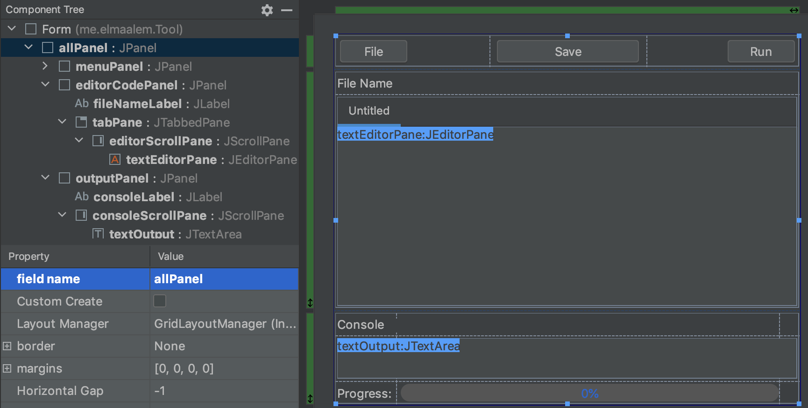
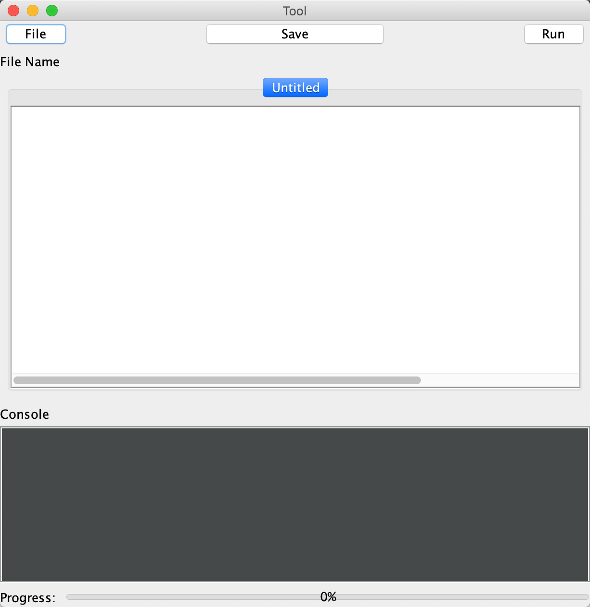
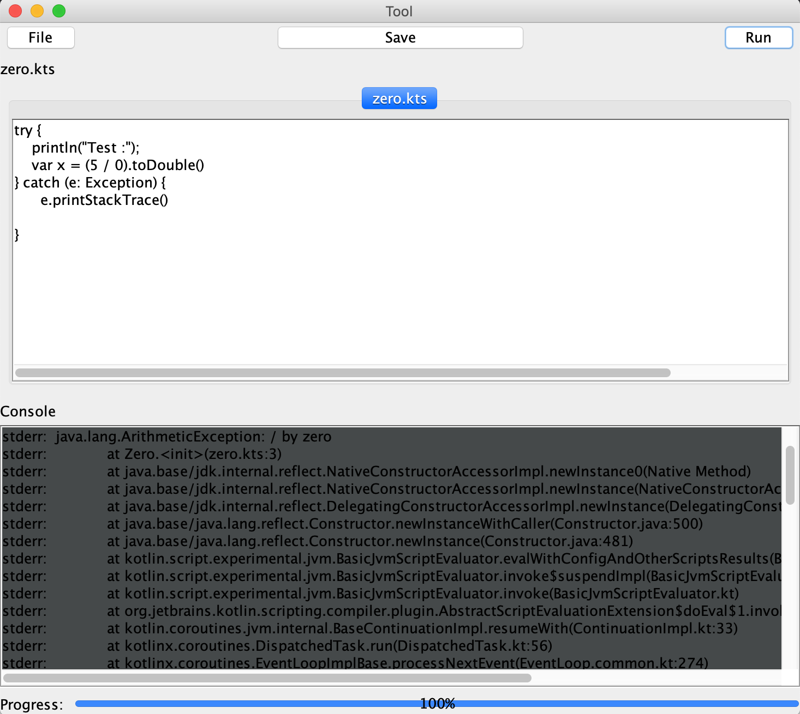

#  How to create a GUI tool(small editor)

### What we are going to build


In this project, we are going to see how to build a `GUI Tool` like a small editor using **Swing** as a GUI widget toolkit for Java. 
This Tool is going to allow users to upload a **Kotlin script** or create a new script and then execute it, and see its output in the console panel.
The editor will be named `Tool`.


### Setup

We are going to use `Maven` as our build tool.

```xml
<?xml version="1.0" encoding="UTF-8"?>
<project xmlns:xsi="http://www.w3.org/2001/XMLSchema-instance"
         xmlns="http://maven.apache.org/POM/4.0.0"
         xsi:schemaLocation="http://maven.apache.org/POM/4.0.0 http://maven.apache.org/xsd/maven-4.0.0.xsd">
    <modelVersion>4.0.0</modelVersion>

    <groupId>groupId</groupId>
    <artifactId>GUITool</artifactId>
    <version>1.0-SNAPSHOT</version>

    <properties>
        <kotlin.version>RELEASE</kotlin.version>
    </properties>

    <dependencies>
        <dependency...>
        <dependency...>
        <dependency...>
    </dependencies>

    <build>
        <plugins>
            <plugin...>
            <plugin...>    
        </plugins>
    </build>
</project>
```

### How to create a graphic design

First of all, we need to create `Swing UI Designer` and then click on `GUI Form`. 
After that, we need to add some components in the **Pallete** such as JPanel, JButton, etc. In parallel, we organize our components in the form.
Finally, we get this design as you can see in the screen below .



###  How to run this tool 


- First, you will need to click of button **Run** in `IntelliJ IDEA` (^R) and you get this interface design:

 

- As you can see, this tool has ***three panel***:

    1. `Menu Panel` contains ***three Button***:
    
        - `File Button`: With this Button , you can upload your script ,or you can create it for the first time.
        
        - `Save Button`: This Button gives you the possibility to edit your script and save it.
        
        - `Run Button`: When you will have your script in **JEditorPane** ,then you can run your script with this Button.   
        
    2. `Editor Code Panel` contains **JEditorPane** which is the main component and gives you the possibility to edit your code.
    
    3. `Output Panel` contains :
    
        - `Text Output`: With this Text Area give you ***four functionality***:
        
            1. Show you live output of your script as it executes.
            
            2. Show errors from the execution when your script couldn’t be interpreted.
            
            3. Show an indication of whether the script is currently running.
            
            4. Show an indication of whether the exit code of the last run was non-zero.
        
        - `Progress Bar`: To visualize the progression of your running script.


###  Example with Script throw error **division by zero**


 


          


